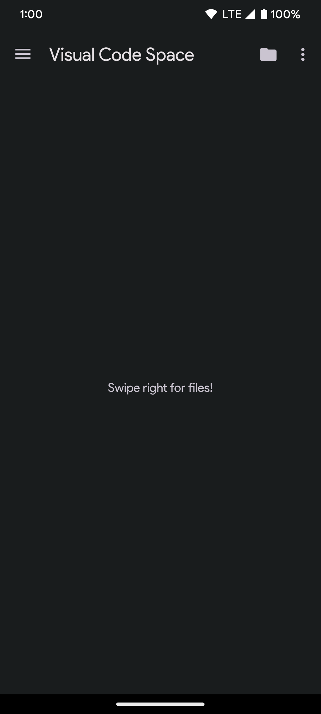
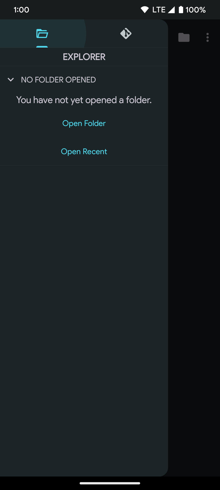

    
    <h1>Visual Code Space</h1>
    

# Screenshots

    
    

### TODO
- [ ] IntelliSense: Provides intelligent code completion suggestions as you type, based on the language you're working with.
- [ ] Debugging: Built-in debugging tools allow you to debug your code directly in the editor.
- [ ] Git integration: Manage your source code with Git integration, including support for branching, merging, and committing changes.
- [ ] Extensions: A vast library of extensions allows you to customize your development environment to your needs.
- [x] Code highlighting: Syntax highlighting makes it easier to read and write code.
- [ ] Code formatting: Automatically formats code to adhere to established conventions, making it easier to read and maintain.
- [ ] Code navigation: Quickly jump to functions, classes, or other symbols in your codebase.
- [ ] Integrated terminal: Run terminal commands directly in the editor.
- [ ] Multi-language support: Support for multiple languages, including JavaScript, TypeScript, Python, Java, and many more.
- [ ] Theme customization: Change the look and feel of the editor with a wide range of themes.
- [ ] Code snippets: Insert code snippets for commonly used patterns or functions.
- [ ] Task automation: Automate repetitive tasks with customizable task runners and build tools.
- [ ] Interactive playgrounds: Explore and experiment with code in a live, interactive environment.
- [ ] Integrated documentation: Access documentation for libraries and frameworks directly in the app.

### Thanks to
- [Rosemoe](https://github.com/Rosemoe) for [sora-editor](https://github.com/Rosemoe/sora-editor)
- [Akash Yadav](https://github.com/itsaky) for the awesome [AndroidIDE](https://github.com/AndroidIDEOfficial/AndroidIDE)