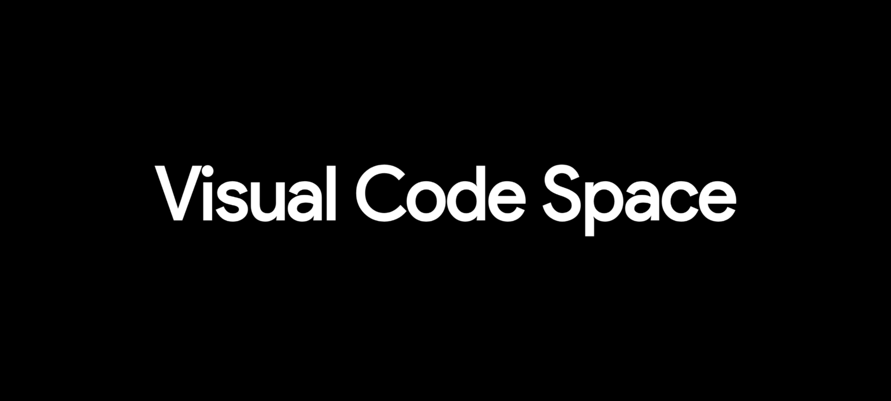
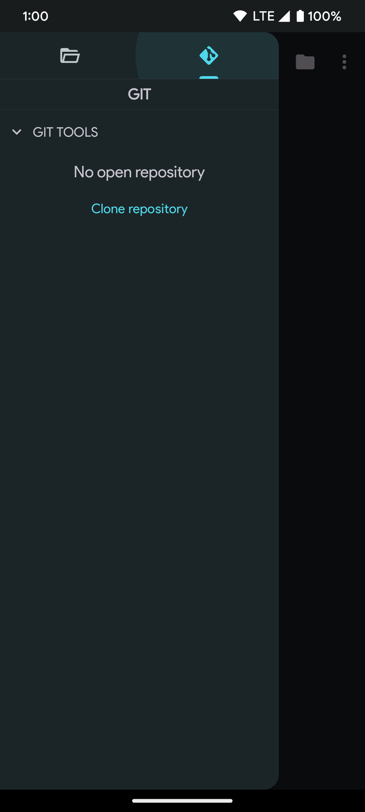
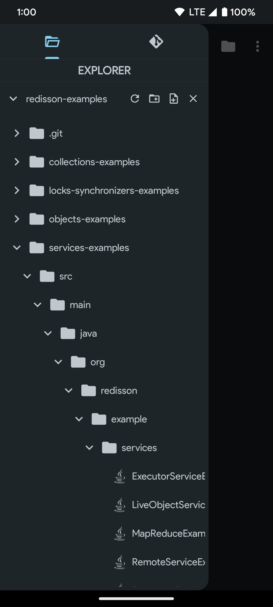
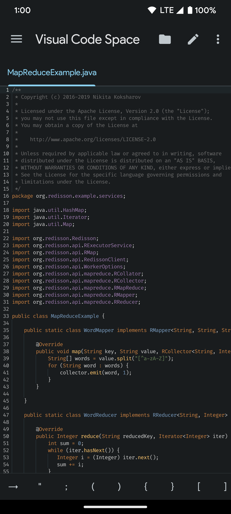
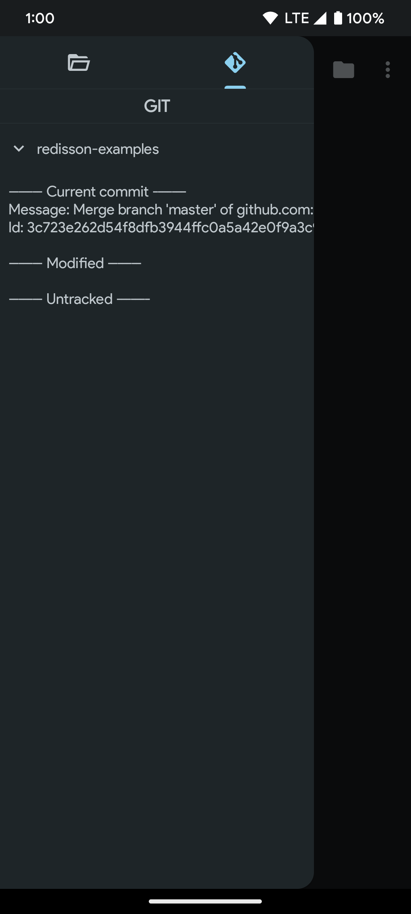
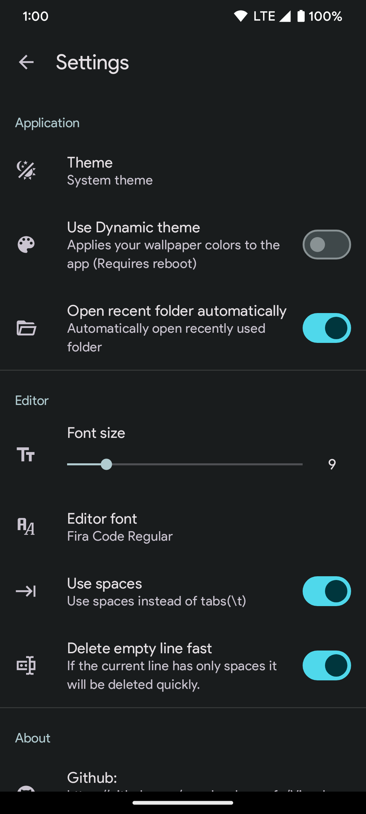
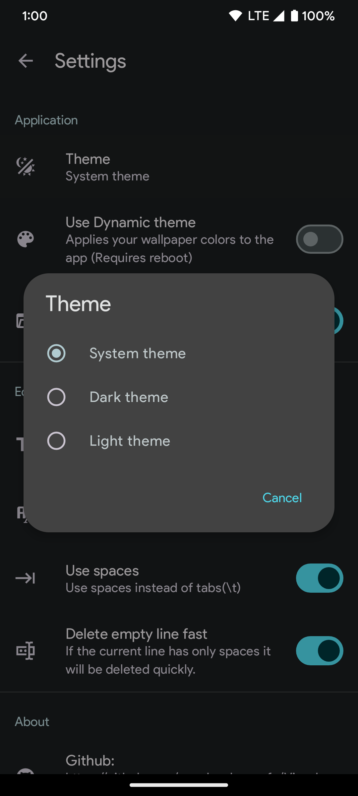
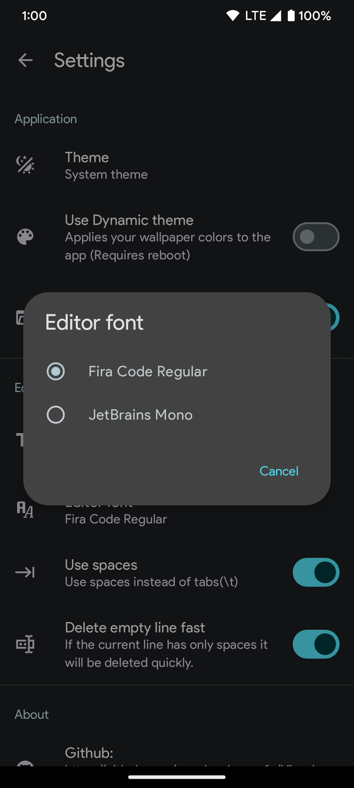

](https://github.com/raredeveloperofc/Visual-Code-Space/actions/workflows/debug_build.yml)

## Screenshots

    
    
    
    
    
    
    
    
    

## TODO
- [ ] Git integration: Manage your source code with Git integration, including support for branching, merging, and committing changes.
- [ ] Extensions: A vast library of extensions allows you to customize your development environment to your needs.
- [x] Code highlighting: Syntax highlighting makes it easier to read and write code.
- [ ] Code navigation: Quickly jump to functions, classes, or other symbols in your codebase.
- [ ] Integrated terminal: Run terminal commands directly in the editor.
- [X] Multi-language support: Support for multiple languages, including JavaScript, TypeScript, Python, Java, and many more.
- [ ] Theme customization: Change the look and feel of the editor with a wide range of themes.
- [ ] Code snippets: Insert code snippets for commonly used patterns or functions.
- [ ] Task automation: Automate repetitive tasks with customizable task runners and build tools.
- [ ] Interactive playgrounds: Explore and experiment with code in a live, interactive environment.
- [ ] Integrated documentation: Access documentation for libraries and frameworks directly in the app.

## Thanks to
- [Rosemoe](https://github.com/Rosemoe) for [sora-editor](https://github.com/Rosemoe/sora-editor)
- [Rosemoe](https://github.com/Rosemoe) for the [language-textmate](https://github.com/Rosemoe/sora-editor/tree/main/language-textmate) for [sora-editor](https://github.com/Rosemoe/sora-editor)
- [Akash Yadav](https://github.com/itsaky) for the awesome [AndroidIDE](https://github.com/AndroidIDEOfficial/AndroidIDE)
- [Visual Studio Code](https://github.com/microsoft/vscode) for [textmate files](https://github.com/microsoft/vscode/tree/main/extensions)

## How to contribute to this project:

When you're working on this project, please make sure your code follows these guidelines:

- Use a 2-space indent for everything.
- For Java code, follow the `GoogleStyle` formatting guidelines. You can either use the `google-java-format` tool or import the code style from [this link](https://raw.githubusercontent.com/google/styleguide/gh-pages/intellij-java-google-style.xml) to your IDE.
- For XML code, use the default formatting guidelines for either Android Studio or AndroidIDE, and also use a 2-space indent.

Thank you for your contributions! We're excited to work with you.
