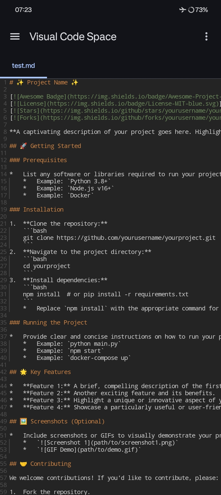
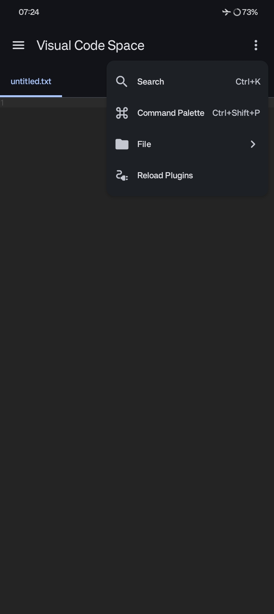
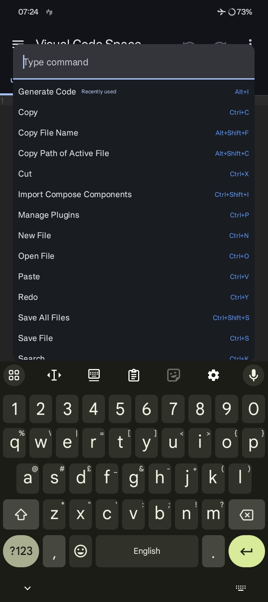
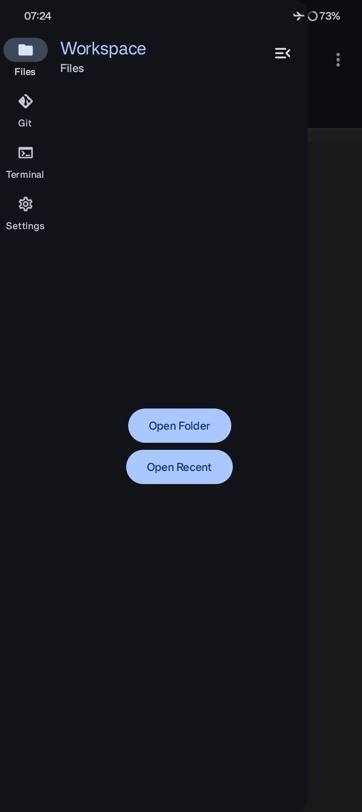
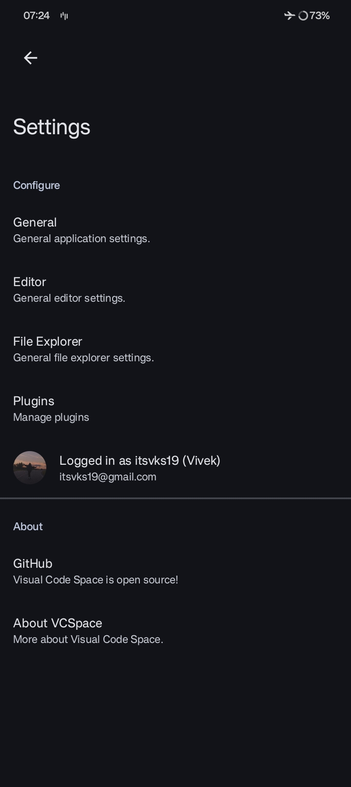
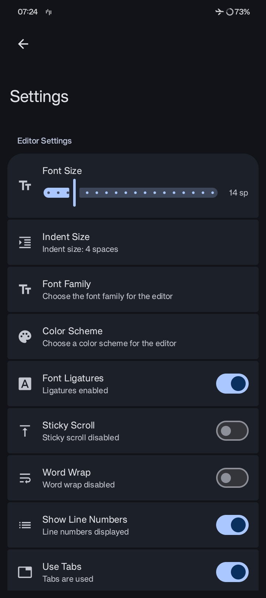
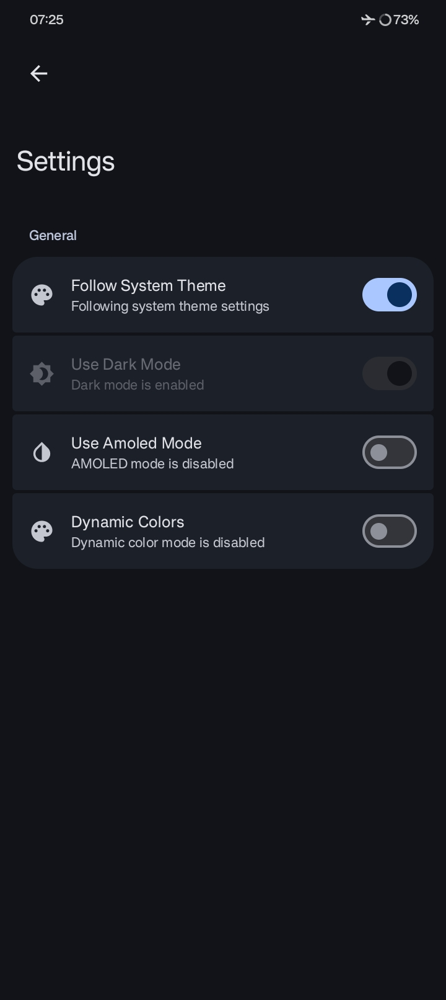
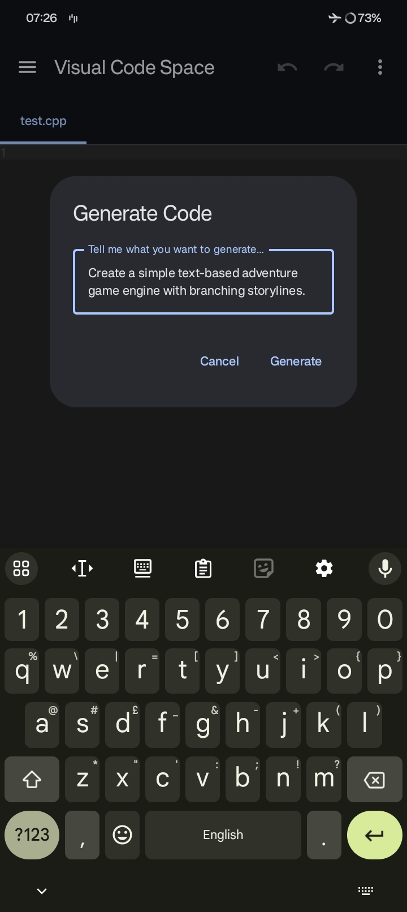
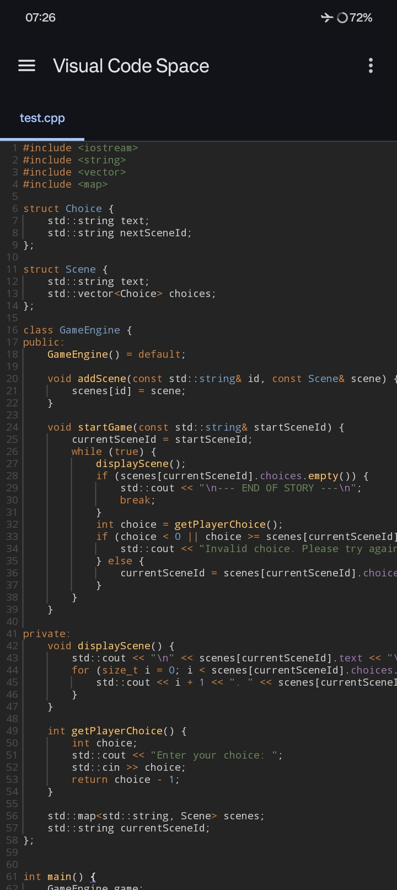

<!--suppress HtmlDeprecatedAttribute, CheckImageSize -->

<div align="center">
  
</div>

<h1 align="center"><b>Visual Code Space</b></h1>
<p align="center"><b>A Modern Code Editor for Android</b></p>

<div align="center">
  <a href="https://github.com/Visual-Code-Space/Visual-Code-Space/actions/workflows/androidci.yml">
    
  </a>
  <a href="https://opensource.org/licenses/GPL-3.0">
    
  </a>
</div>

<br>

<div align="center">
  
  
  
</div>
<div align="center">
  
  
  
</div>
<div align="center">
  
  
  
</div>
<br>
<em>A glimpse of Visual Code Space in action.</em>

<br>

## 🚀 Elevate Your Mobile Coding Experience

**Visual Code Space** is a cutting-edge code editor meticulously crafted for Android devices. It
empowers you to code on the go with a seamless and efficient environment. Forget about cumbersome
setups; dive straight into coding with our intuitive interface and powerful features.

## ✨ Key Features

- **⚡ Blazing Fast File Explorer:** Navigate your project directories with speed and ease.
- **🎨 Multi-Language Syntax Highlighting:** Enjoy syntax highlighting for a wide array of
  programming languages, making your code more readable and less error-prone.
- **📑 Tabbed Editor:** Manage multiple files simultaneously with our convenient tabbed interface.
- **💻 Integrated Terminal Emulator:** Execute commands directly within the app using our built-in
  terminal emulator.
- **🚫 Ad-Free Experience:** Focus on your code without any distractions.
- **🔌 Plugin Support:** Extend the functionality of Visual Code Space with custom plugins written in
  BeanShell.

## 📦 Installation

Ready to start coding? Download the latest version of Visual Code Space from
our [releases page](https://github.com/Visual-Code-Space/Visual-Code-Space/releases)
or [telegram group](https://t.me/visualcodespace).

## 📖 Plugin Development

### Unleash the Power of Customization

Visual Code Space supports custom plugins written in Java, allowing you to tailor the editor to
your specific needs. For detailed instructions and examples, please refer to our [Basic Plugin](docs/plugins/basic-docs.md)
documentation.

## 🤝 Contributing

We are always looking for ways to improve Visual Code Space and welcome contributions from the
community. Please see
our [CONTRIBUTING.md](https://github.com/Visual-Code-Space/Visual-Code-Space/blob/main/CONTRIBUTING.md)
for guidelines on how to get involved.

## 💖 Special Thanks

We extend our gratitude to the following projects and individuals for their invaluable
contributions:

- [Rosemoe](https://github.com/Rosemoe) for
  the [sora-editor](https://github.com/Rosemoe/sora-editor)
- [VSCode](https://github.com/microsoft/vscode) for
  the [TextMate files](https://github.com/microsoft/vscode/tree/main/extensions)
- [Termux](https://github.com/termux) for
  the [Terminal Emulator](https://github.com/termux/termux-app)
- [Akash Yadav](https://github.com/itsaky) for the
  awesome [AndroidIDE](https://github.com/AndroidIDEOfficial/AndroidIDE)

## 🧑‍💻 Contributors

<a href="https://github.com/Visual-Code-Space/Visual-Code-Space/graphs/contributors">
  
</a>

## 📜 License

```
Visual Code Space is free software: you can redistribute it and/or modify
it under the terms of the GNU General Public License as published by
the Free Software Foundation, either version 3 of the License, or
(at your option) any later version.

Visual Code Space is distributed in the hope that it will be useful,
but WITHOUT ANY WARRANTY; without even the implied warranty of
MERCHANTABILITY or FITNESS FOR A PARTICULAR PURPOSE.  See the
GNU General Public License for more details.

You should have received a copy of the GNU General Public License
along with Visual Code Space.  If not, see <https://www.gnu.org/licenses/>.
```

Any violations to the license can be reported either by opening an issue or writing a mail to us
directly.